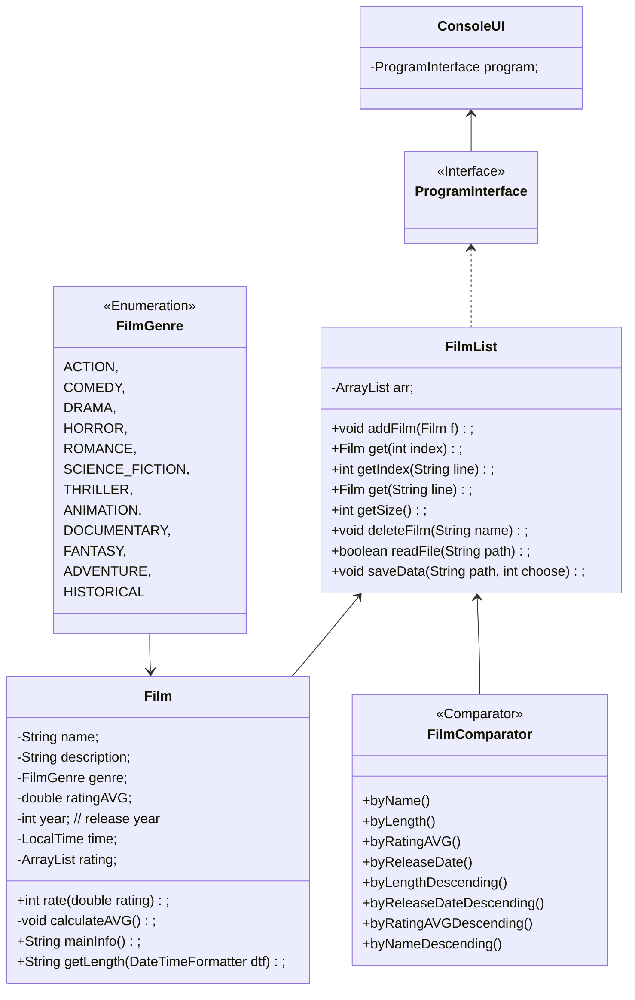

# Film Finder

## Zadání práce

### Motivace

Vždycky jsem se rád díval na filmy, už od dětství jsem sledováním filmů trávil spoustu času. V poslední době potkávám hodně známých/přátel, kteří se často ptají, na jaký film se mohou podívat. Uvědomil jsem si, že je spousta lidí, kteří se chtějí na něco podívat, ale nevědí, na koho se obrátit o radu.
Můj program pomůže lidem najít film, aby si udělali hezký večer.

### Popis problému

Úkolem je vytvořit program, který načte data ze souboru a uživatel může vyhledat filmy pomocí třídění a filtrování tak, aby uživatel mohl najít film na večer.

## Řešení

Program načte filmy a jejich data ze souboru a pak má uživatel na výběr 7 funkcí:
1. Přidat film do seznamu. 
   - Nejprve se přidá název, poté může uživatel přidat žánr (žánr může nabývat 1 ze 14 hodnot (enum FilmGenre)), rok, délku trvání filmu (délka filmu se zobrazuje ve formátu: hodiny minuty sekundy (oddělené mezerou).) a popis. 
2. Smazat film ze seznamu. 
   - Uživatel zadá název filmu a program jej odstraní ze seznamu, pokud existuje.
3. Vybrat film a upravit jeho detaily. 
   - Uživatel zadá název filmu, pokud existuje, program zobrazí seznam všech informací o filmu. Uživatel má možnost změnit název, žánr, délku trvání, rok, popis nebo přidat hodnocení filmu.
4. Zobrazit seznam filmů. 
   - Program vypíše celý seznam filmů a jejich hlavní informace.
5. Třídění podle různých kategorií. 
   - Uživatel může třídit filmy podle různých kritérií: 
     * A až Z nebo Z až A, 
     * od nejnovějšího po nejstarší a naopak,
     * od nejlepšího po nejhorší (podle hodnocení) a naopak,
     * od nejkratšího po nejdelší a naopak.
6. Filtrování seznamu filmů podle různých polí. Uživatel může filtrovat podle těchto kritérií: 
   - Žánr -  Uživatel může přidat žánry pro filtrování a poté se zobrazí seznam všech filmů s přidanými žánry.
   - Délka filmu - Uživatel nastaví minimální a maximální délku filmu a program vypíše pouze ty, které spadají do tohoto rozmezí
   - Rok vydání - Uživatel nastaví minimální a maximální rok vydání a software vypíše pouze ty, které spadají do tohoto rozmezí
8. Ukládání filmů do souborů (textových i binárních). 
   - Uživatel nastaví složku, ve které chce vidět uložené filmy. Později si uživatel zvolí zápis do textového nebo binárního souboru, pokud soubor ve složce uživatele existuje, program zapíše všechna data a potvrdí na obrazovce 
9. Ukončení programu, pokud potvrdíte výběr, program se ukončí. 

## Popis struktury vstupních a výstupních souborů
V programu používám 4 soubory:
1. **data_film.txt** je textový soubor obsahující filmy seřazené od A do Z.  
V souboru je uložen název filmu, žánr filmu, rok vydání a délka filmu. Soubor se používá pro zápis do souboru a taky čtení ze souboru.  
Tento soubor má tuto strukturu:
   - Název filmu "\t" žánr "\t" rok vydání "\t" délka filmu "\n"  
Žánr má datový typ FilmGenre (enum), může nabývat 1 ze 14 hodnot  
Délka filmu (délka filmu se zaznamenává ve formátu: hodiny minuty sekundy (oddělené dvojtečkou)).
2. **film_description.txt** je textový soubor obsahující popisy filmů seřazené od A do Z.   
Soubor obsahuje název filmu a jeho popis. Soubor slouží k zápisu do souboru i ke čtení ze souboru.  
Tento soubor má tuto strukturu:
   - Název filmu "\t" popis filmu "\n"
3. **film_rates.txt** je textový soubor, který obsahuje známky filmů.  
Soubor obsahuje název filmu a jeho partitury. Soubor slouží k zápisu do souboru i ke čtení ze souboru.  
Tento soubor má tuto strukturu:
   - Název filmu "\t" všechna hodnocení tohoto filmu jsou oddělena čárkami "\n"
4. **film_data.bin** je binární soubor obsahující filmy seřazené od A do Z.  
Soubor obsahuje název filmu, žánr filmu, rok uvedení a délku trvání filmu. Soubor slouží pouze k zápisu do souboru.  
Tento soubor má stejnou strukturu jako **data_film.txt**, avšak uložené binárně

## Class Diagram

## Popis fungování externí knihovny
1. Apache Commons IO. 
   Tuto knihovnu používám k zápisu do textových souborů.
      - Apache Commons IO poskytuje jednoduché a intuitivní metody pro zápis do souborů. Například metoda FileUtils.write() umožňuje snadno zapsat textová data do souboru jedním řádkem kódu.
      - Použití knihovny Apache Commons IO umožňuje provádět operace IO efektivněji a snadněji. Místo psaní vlastního kódu pro zápis do souborů můžete použít připravené funkce, které knihovna poskytuje.
2. Apahce Commons Collections4.
   Z této knihovny používám komparátor pro třídění objektu 'FilmList'.
      - Knihovna Apache Commons Collections4 poskytuje také další utility pro práci s kolekcemi, jako je například vytváření inverzních Comparatorů, hledání maximálního/minimálního prvku v kolekci nebo vytváření porovnávacích řetězců.
      - Comparator z Apache Commons Collections4 je schopný pracovat s různými datovými typy, včetně vlastních objektů, číselných hodnot, textových řetězců atd. Poskytuje vám tedy flexibilitu při porovnávání různých typů objektů.

